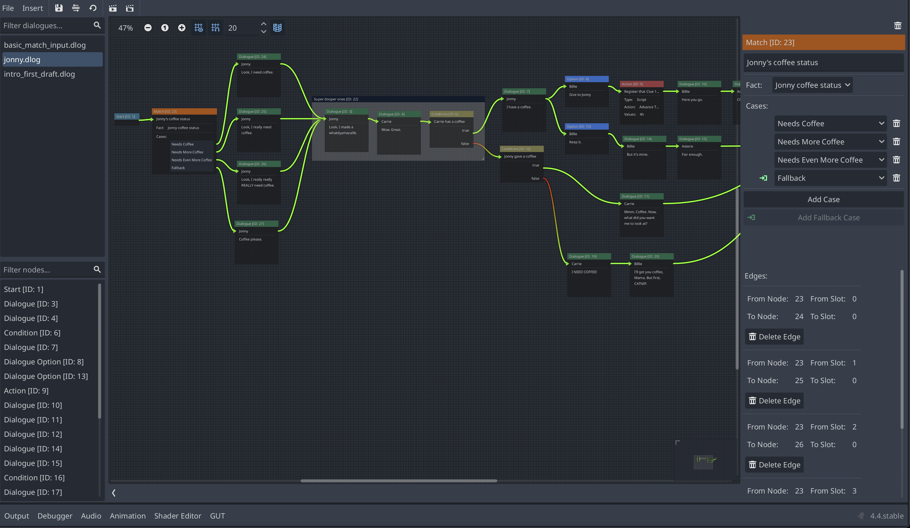

# Parley

Parley is an addon for [Godot 4.4+](https://godotengine.org/) that provides a
graph-based dialogue manager for easy writing, testing, and running of dialogue
sequences at scale. Write your dialogue sequences by defining the graph for your
dialogue sequence which are backed by a well-defined Dialogue AST for easy
management and integration within your game.

<!-- TODO: check the link -->
<!-- TODO: credits and licensing -->

You can install it via the Asset Library or
[downloading a copy](https://github.com/bisterix-studio/parley/archive/refs/heads/main.zip)
from GitHub.

## Table of contents

- [Table of contents](#table-of-contents)
- [Features](#features)
- [Installation](#installation)
- [Documentation](#documentation)
- [Support](#support)
- [License](#license)

Installation Features Examples Support Useful links License Contributions

## Features

- An easy to use and well-defined Graph Editor
- A wide variety of nodes for maximum flexibility:
  - [Dialogue](docs/nodes/dialogue_node.md)
  - [Dialogue Option](docs/nodes/dialogue_option_node.md)
  - [Condition](docs/nodes/condition_node.md)
  - [Match](docs/nodes/match_node.md)
  - [Action](docs/nodes/action_node.md)
  - [Group](docs/nodes/group_node.md)
  - [Start](docs/nodes/start_node.md)
  - [End](docs/nodes/end_node.md)
- Creation of connections between nodes to easily see the flow of your dialogue
  sequence
- Easy testing of your dialogue at any stage in the sequence
- Well-defined Dialogue AST for easy review and management of Dialogue Sequences
- Character store for management of characters in Dialogue and Dialogue Options
- Action store for management of actions for use with Action nodes
- Fact store for management of facts for use with Condition and Match nodes
- An out of the box dialogue balloon to get started straight away
- Easy management of your dialogue sequences, including node filtering
- Export of Dialogue passages

## Installation

<!-- TODO: check the link -->

You can install it via the Asset Library or
[downloading a copy](https://github.com/bisterix-studio/parley/archive/refs/heads/main.zip)
from GitHub.

## Documentation

Documentation for Parley can be found [here](docs/parley.md).

## Support

| Version  | Supported	Godot version |
| -------- | ----------------------- |
| `latest` | `4.4+`                  |

## License

Parley is 100% free and open-source, under the MIT license.
