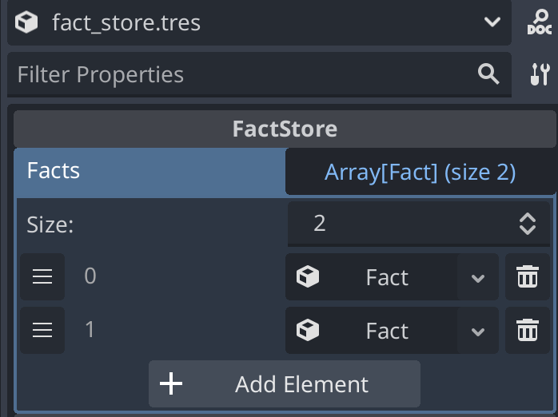
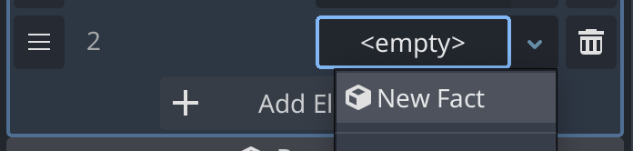
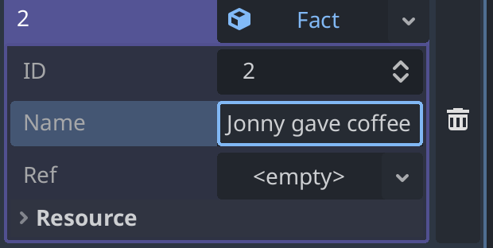
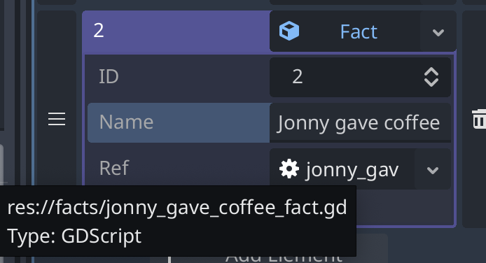
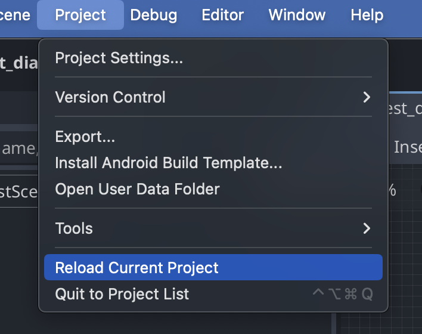

# How-To add a Fact

Facts are resources in Parley used by Condition Nodes for comparisons within the
running game. For example, one might want to display different dialogue
depending on whether Alice gave a coffee or not.

Facts are stored in a fact store which can be configured in the Parley settings.

In this How-To guide, we will create a fact that can be used to create a
Condition Node in the corresponding
[How-To create a Condition node guide](./how_to_create_condition_node.md).

## Pre-requisites

- Ensure you have familiarised yourself with the
  [Condition Node](../nodes/condition_node.md) docs.

- Parley is installed and running in your Godot Editor.

<!-- TODO: maybe add a link here -->

- You have created a basic Dialogue Sequence before. Consult the other How-To
  guides for more info.

<!-- TODO: update when Parley supports creation of Fact -->

## Instructions

> **Note:** it is assumed that the default Parley settings are used for the fact
> store and it is stored at: `res://facts/fact_store_main.tres`

- Create a Fact script (ensure that it extends the `FactInterface` class) at:
  `res://facts/alice_gave_coffee_fact.gd`

```gdscript
extends FactInterface

func execute(_ctx: Dictionary, _values: Array) -> bool:
	print('Alice did indeed give coffee')
  # Note, you can return any value here, it doesn't
  # necessarily have to be a bool
	return true
```

- [OPTIONAL] If the return type of your fact, is **not** of type `bool`, it is
  recommended to return well-known values of the fact (for example, when using a
  [Match Node](../nodes/match_node.md)). For example:

```gdscript
extends FactInterface

enum Ball {
	RED = 1,
	YELLOW = 2,
	PINK = 6,
	BLUE = 5,
}

func execute(ctx: Dictionary, _values: Array) -> int:
	return ctx.get('ball', 0)

func available_values() -> Array[Ball]:
	return [
		Ball.RED,
		Ball.YELLOW,
		Ball.PINK,
		Ball.BLUE,
	]
```

- Open up the inspector for `res://facts/fact_store_main.tres` in the Godot
  Editor and click `Add Element`:



- Then, click the empty element and choose `New Fact`:



- Now populate the fact ID by using the same element ID (recommended but not
  essential) and choose a sensible name for the Fact in the store:



- Then, drag the fact script created earlier to the `<empty>` ref field:



<!-- TODO: change/remove this when supported Parley -->

- Finally, reload the Godot project and the new fact should be available to use
  in Parley!


