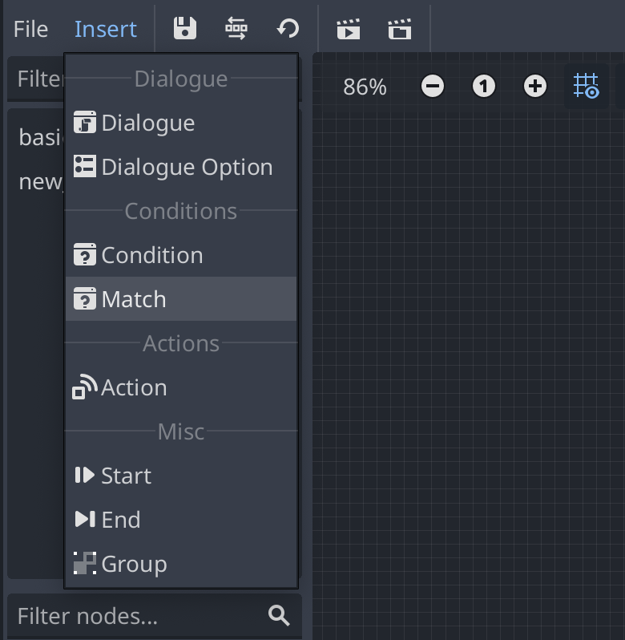
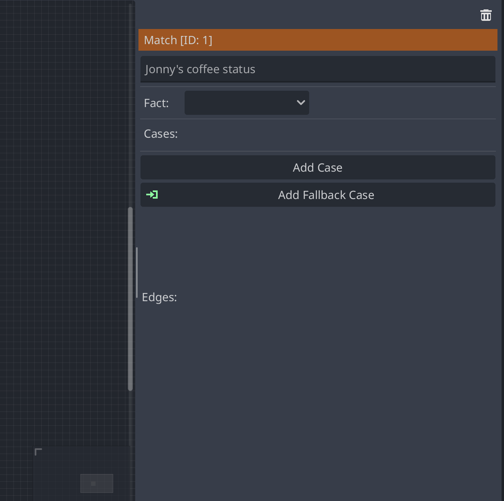
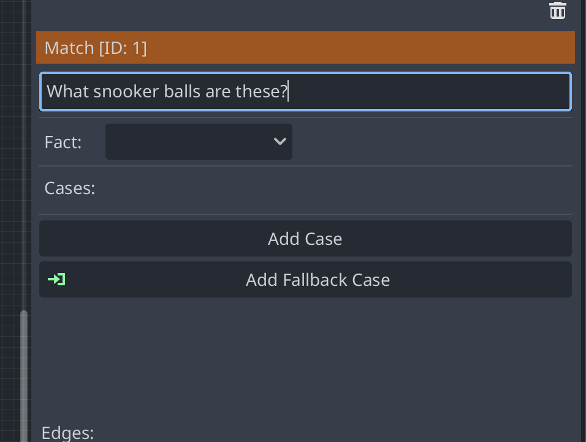
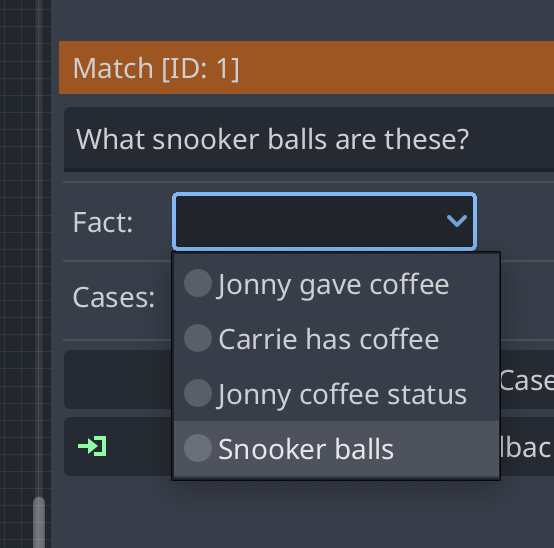
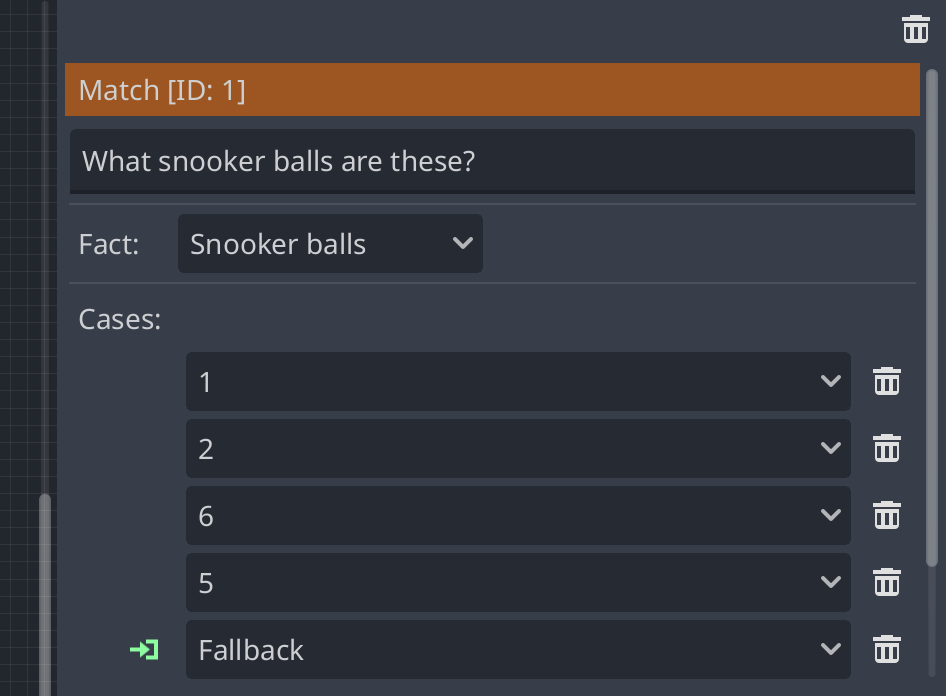
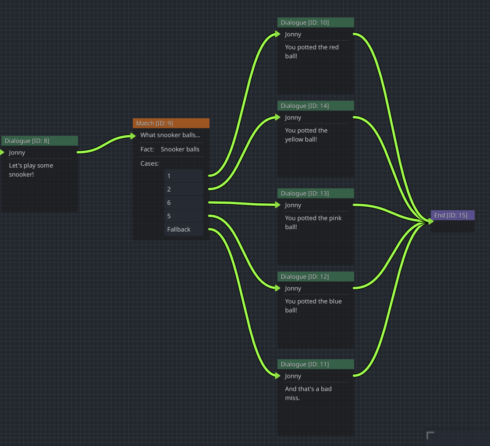
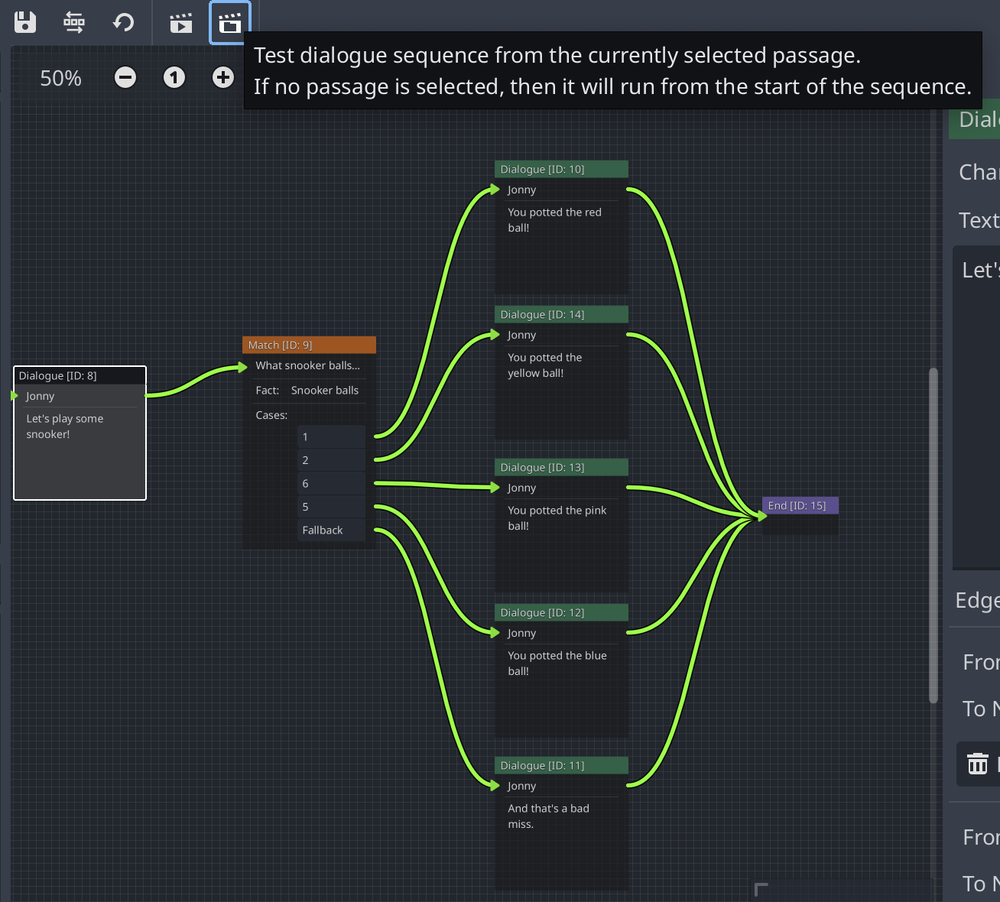

# How-To create a Match Node

<!-- TODO: add Parley examples folder -->

A Match Node is useful for selecting the next node based on the well-known value
of a variable or expression. You can find all sorts of Dialogue Sequence
examples in the Parley `examples` folder.

## Pre-requisites

- Ensure you have familiarised yourself with the
  [Match Node](../nodes/match_node.md) docs.
- Parley is installed and running in your Godot Editor.
- You have followed the [instructions](./how_to_add_fact.md) to add the relevant
  facts to the system. Make sure you create a fact with well-known values.

<!-- TODO: maybe add a link here -->

- You have created a basic Dialogue Sequence before. Consult the other How-To
  guides for more info.

## Instructions

- Create a Match Node using the `Insert` dropdown:

- Click on the created Match Node in the graph view to open up the Match Node
  Editor:

- Enter a high-level descriptive name for what the Match Node represents. This
  is because it can be sometimes hard to work out what matches are doing so the
  more info you can provide up front the better!

- Select a fact using the dropdown. In this case, we will select the
  `Snooker balls` fact. Facts are manually defined scripts that execute when a
  match is evaluated and return a value to be checked later in the match. These
  also define well-known values that are used to select against.

- Now choose your cases you want to select against. Here we will choose all of
  the available cases including the fallback case. This means that even if we
  don't select on a case, the fallback will be chosen as the next path.

- Click the `Save` button in the Parley editor and there we have it! Our first
  Match Node. Now connect this Node up with other Nodes (here, we define a basic
  setup for each possible input and output of the Match Node):

- You can test out your Dialogue Sequence by clicking the Test Dialogue Sequence
  from start button:

