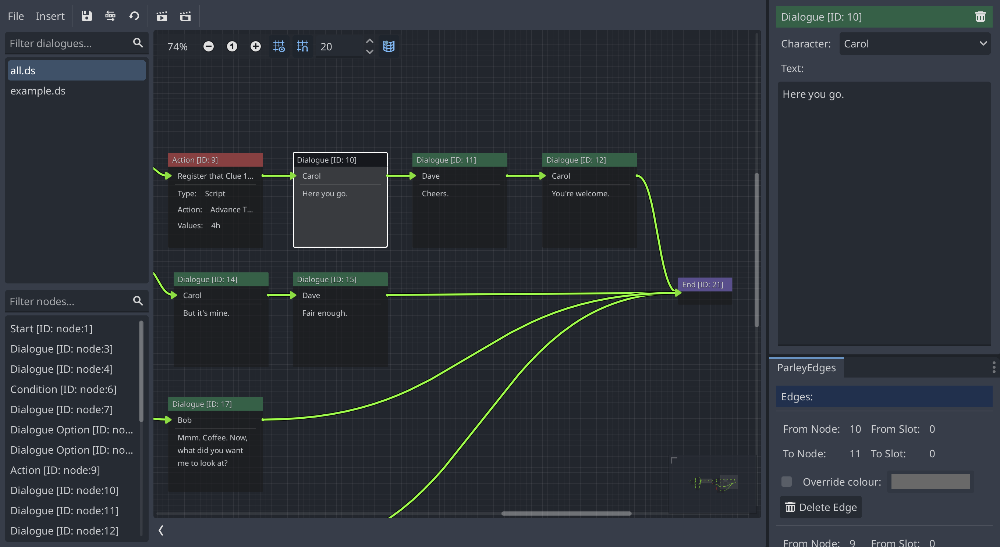

A Dialogue Node defines a passage of dialogue for a character within the
Dialogue Sequence. It is associated with a character which can be used to
enhance the displayed dialogue.

They have the following characteristics:

## Character

The character associated with the Dialogue Node. These are stored in the
character store and determine the available characters that can be used to
select against.

## Text

The text of the Dialogue. For example, something that the character says.

> [tip]: The text input supports Godot
> [BBCode](https://docs.godotengine.org/en/latest/tutorials/ui/bbcode_in_richtextlabel.html)
> which can be used to enhance the look of your displayed dialogue.
