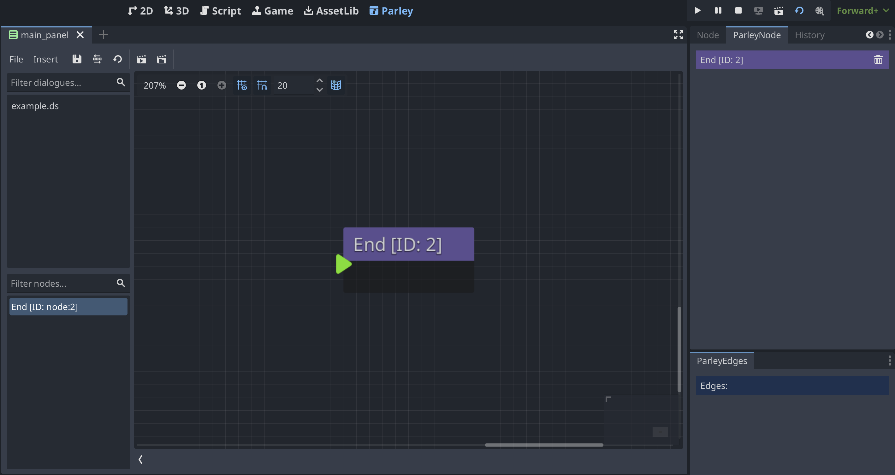

An End Node defines the end of the Dialogue Sequence. Although Dialogue
Sequences do not require the presence of End Nodes to end a running Dialogue
Sequence, it is recommended to do so to make it clear to the Dialogue Sequence
writer that reaching this node ends the currently open dialogue. You can find
all sorts of Dialogue Sequence examples in the Parley `examples` folder.

Other than defining the end of the Dialogue Sequence, they don't have any other
characteristics.

> If a Dialogue Sequence does not define an End Node, the end will be detected
> when no nodes follow the currently running node. However, as mentioned above,
> it is recommended to define an End Node to make it clear to the Dialogue
> Sequence writer that reaching this node ends the currently open dialogue.
