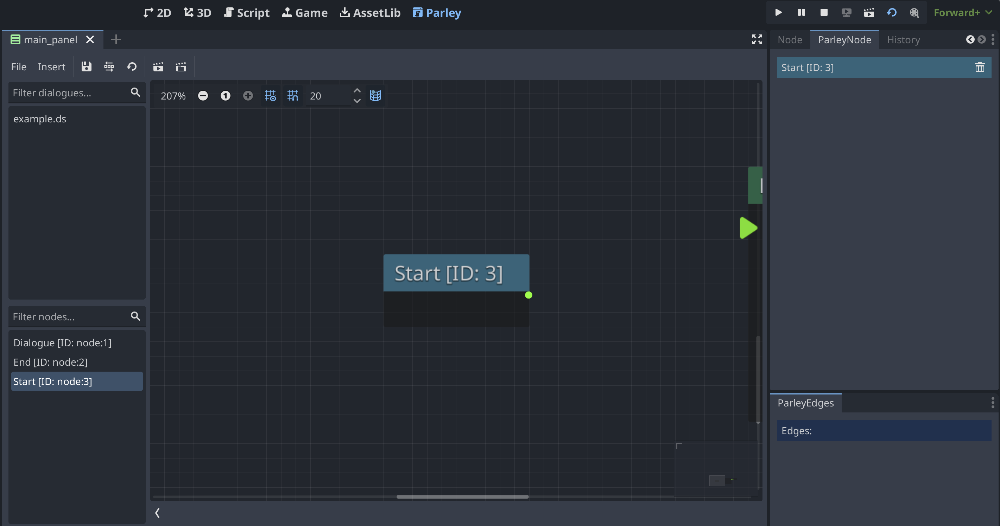

A Start Node defines the start of the Dialogue Sequence. For a Dialogue Sequence
to be valid at runtime, there must be one and only one Start Node defined. You
can find all sorts of Dialogue Sequence examples in the Parley `examples`
folder.

Other than defining the start of the Dialogue Sequence, they don't have any
other characteristics.

## Errors

### No Start Node present

If there is no Start Node present, an error will be pushed to the console when
running the Dialogue Sequence:

### Multiple Start Nodes present

If there are multiple Start Nodes present, an error will be pushed to the
console when running the Dialogue Sequence:

