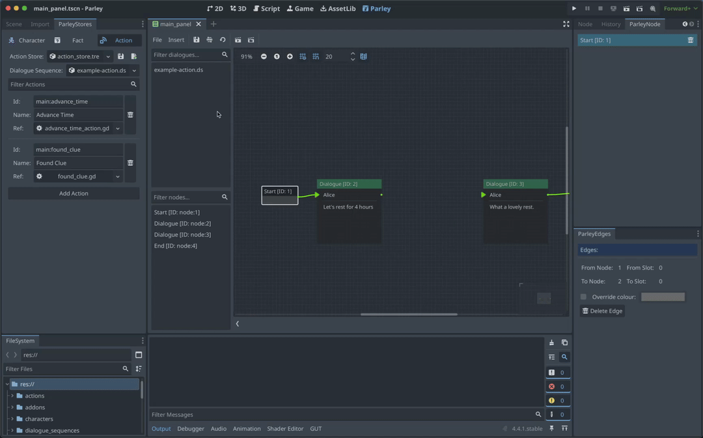

An Action Node gives the ability to execute functionality during the processing
of a Dialogue Sequence. For example, emitting a signal, registering a journal
entry, or updating state. You can find all sorts of Dialogue Sequence examples
in the Parley
[`examples`](https://github.com/bisterix-studio/parley/tree/main/examples)
folder.

## Pre-requisites

- Ensure you have familiarised yourself with the
  [Action Node](../nodes/action-node.md) docs.
- Parley is [installed](./installation.md) and running in your Godot Editor.
- You have followed the [instructions](./register-action.md) to add the relevant
  actions to the system.
- You have created a basic Dialogue Sequence before. Consult the
  [getting started guide](./create-dialogue-sequence.md) for more info.

## Instructions

1. Create an Action Node using the `Insert` dropdown.
2. Click on the created Action Node in the graph view to open up the Action Node
   Editor.
3. Enter a high-level descriptive name for what the Action Node represents. This
   is because it can be sometimes hard to work out what actions are doing so the
   more info you can provide up front the better! In this example, we write:
   `Advance time [4h]`
4. Choose the type of Action you want from the dropdown. In this example, we
   choose: `Script`.
5. Select the Action you want execute as part of this Node. In this example, we
   choose: `Advance Time`.

> [tip]: You can click on the pencil icon to the right of the Action to view the
> selected script in the Godot GDScript editor and optionally edit it.

1. Choose a value to pass to the Action Node. This must be a value understood by
   the underlying script (chosen in the previous step). In this example, we set
   to: `4h`.
2. Click the `Save` button in the Parley editor and there we have it! Our first
   dialogue sequence with an Action Node.
3. Now connect this Node up with other Nodes to continue the Dialogue Sequence
   with your awesome game writing!
4. You can test out your Dialogue Sequence by clicking the Test Dialogue
   Sequence from start button.
