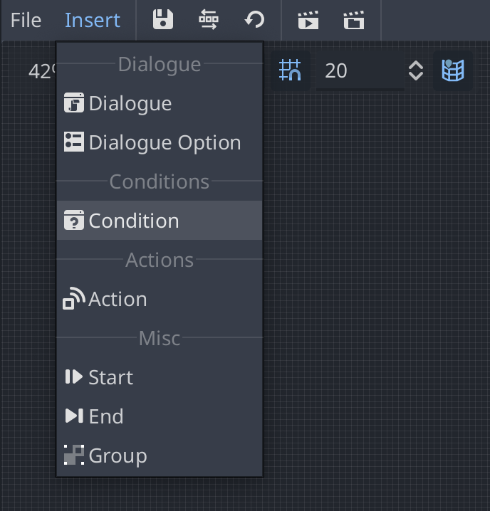
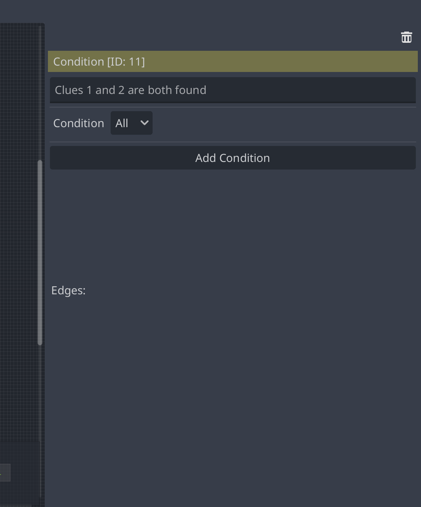
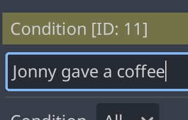
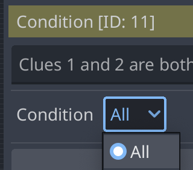
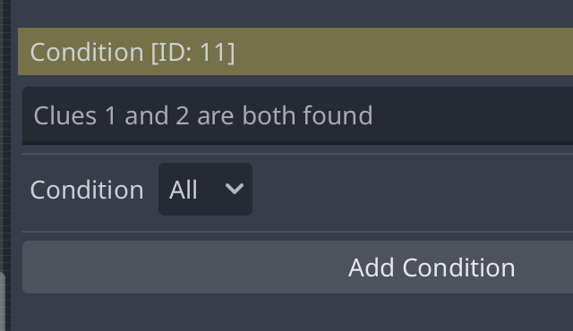
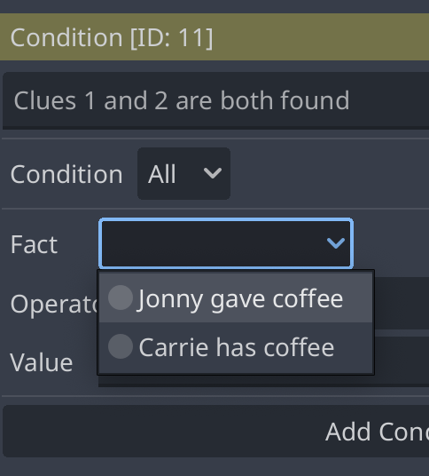
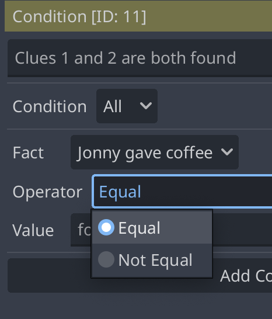
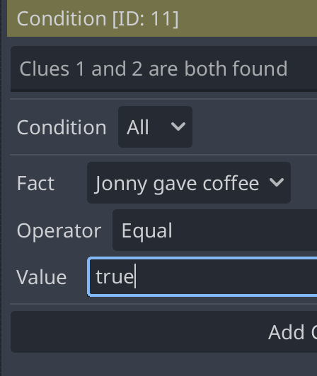
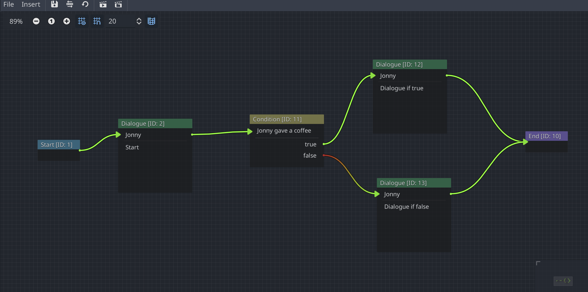
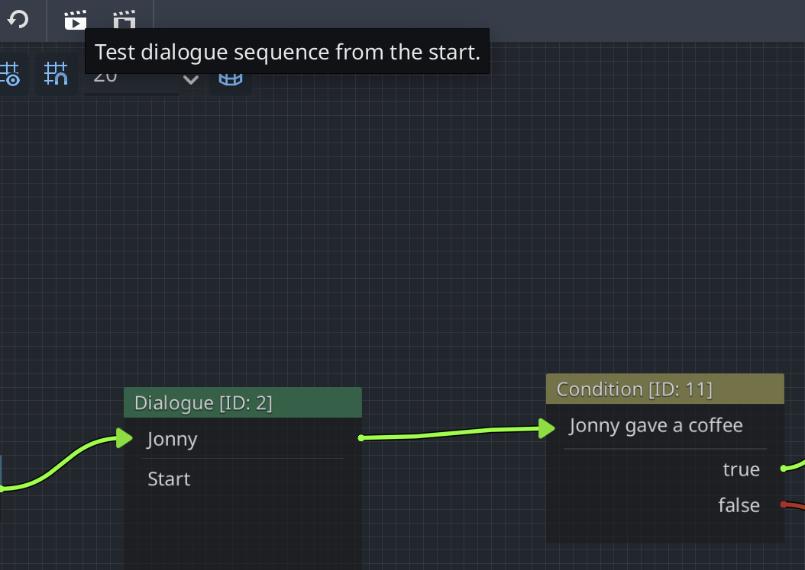

<!-- TODO: add Parley examples folder -->
<!-- TODO: redo screenshots as they will be out of date now -->

Condition Nodes can be used to conditionally direct users down different
dialogue branches or even conditionally render options. They are designed to be
infinitely nested in theory and you can find all sorts of Dialogue Sequence
examples in the Parley `examples` folder.

## Pre-requisites

- Ensure you have familiarised yourself with the
  [Condition Node](../concepts/condition-node.md) docs.
- Parley is installed and running in your Godot Editor.
- You have followed the [instructions](./register-fact.md) to add the relevant
  facts to the system.
- You have created a basic Dialogue Sequence before. Consult the
  [getting started guide](./create-dialogue-sequence.md) for more info.

## Instructions

- Create a Condition Node using the `Insert` dropdown:

- Click on the created Condition Node in the graph view to open up the Condition
  Node Editor:

- Enter a high-level descriptive name for what the Condition Node represents.
  This is because it can be sometimes hard to work out what conditions are doing
  so the more info you can provide up front the better!

- Now choose a combiner for all of your conditions. Here we will choose `All`
  which means that all of the conditions have to pass in order for the Condition
  Node to be `true`.

- Next up is to define the conditions for the combiner. Click `Add Condition`.
  During the running of a dialogue sequence, each condition will be evaluated in
  turn and sent to the combiner to calculate whether the Condition Node is
  truthy (or not). Note, you create more than one condition for the combiner.

- Select a fact using the dropdown. In this case, we will select the
  `Alice gave coffee` fact. Facts are manually defined scripts that execute when
  a condition is evaluated and return a value to be checked later in the
  condition.

- Next, choose an operator. Here, we will use the `Equal` operator. This will be
  used to compare the result of the fact against a defined value (coming next!).

<!-- TODO: update the coercion note when this is finalised. -->

- Finally, choose a value to compare with. Here we set the value to `true`.
  Please note, Parley does perform a basic level of coercion so in this case,
  this will be a GDScript `bool`.

- Click the `Save` button in the Parley editor and there we have it! Our first
  Condition Node. Now connect this Node up with other Nodes (here, we define a
  basic setup for each possible input and output of the Condition Node):

- You can test out your Dialogue Sequence by clicking the Test Dialogue Sequence
  from start button:

