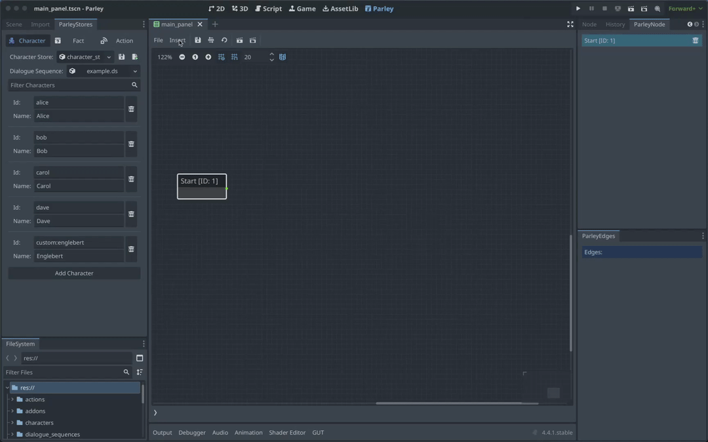

A Dialogue Node defines a passage of dialogue for a character within the
Dialogue Sequence. It is associated with a character which can be used to
enhance the displayed dialogue. You can find all sorts of Dialogue Sequence
examples in the Parley
[`examples`](https://github.com/bisterix-studio/parley/tree/main/examples)
folder.

## Pre-requisites

- Familiarise yourself with the [Dialogue Node](../nodes/dialogue-node.md) docs.
- Parley is installed and running in your Godot Editor.
- You have followed the [instructions](./register-character.md) to add the
  relevant characters to the system.
- You have created a basic Dialogue Sequence before. Consult the
  [getting started guide](./create-dialogue-sequence.md) for more info.

## Instructions

1. Create a Dialogue Node using the `Insert` dropdown.
2. Click on the created Dialogue Node in the graph view to open up the Dialogue
   Node Editor.
3. Choose a character for your Dialogue Node form the dropdown.
4. Write some text for your Dialogue that will be displayed to the user.
5. Click the `Save` button in the Parley editor and there we have it! Our first
   dialogue sequence with dialogue.
6. Now connect this Node up with other Nodes to continue the Dialogue Sequence
   with your awesome game writing!
7. You can test out your Dialogue Sequence by clicking the Test Dialogue
   Sequence from start button.

> [tip]: You can quickly create dialogue nodes by creating an edge on the right
> hand side of the node and dragging it into empty space. A Dialogue Node will
> be created when the mouse is released.
