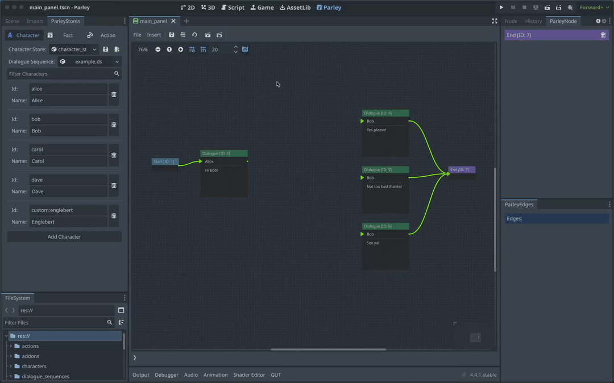

A Dialogue Node defines a series of options presented to the player within the
Dialogue Sequence. You can find all sorts of Dialogue Sequence examples in the
Parley
[`examples`](https://github.com/bisterix-studio/parley/tree/main/examples)
folder.

## Pre-requisites

- Familiarise yourself with the
  [Dialogue Option Node](../nodes/dialogue-option-node.md) docs.
- Parley is [installed](./installation.md) and running in your Godot Editor.
- You have followed the [instructions](./register-character.md) to add the
  relevant characters to the system.
- You have created a basic Dialogue Sequence before. Consult the
  [getting started guide](./create-dialogue-sequence.md) for more info.

## Instructions

1. Create Dialogue Option Nodes using the `Insert` dropdown.
2. Click on each created Dialogue Node in the graph view to open up the Dialogue
   Node Editor.
3. Click the `Save` button in the Parley editor and there we have it! Our first
   dialogue sequence with dialogue options.
4. Now connect these Nodes up with other Nodes to continue the Dialogue Sequence
   with your awesome game writing!
5. You can test out your Dialogue Sequence by clicking the Test Dialogue
   Sequence from start button.

> [tip]: The order of the Dialogue options is determined by the vertical (or y)
> position of the nodes in the Dialogue Sequence graph editor. Developers can
> therefore influence the order of dialogue options by swapping options around
> vertically in the editor.
