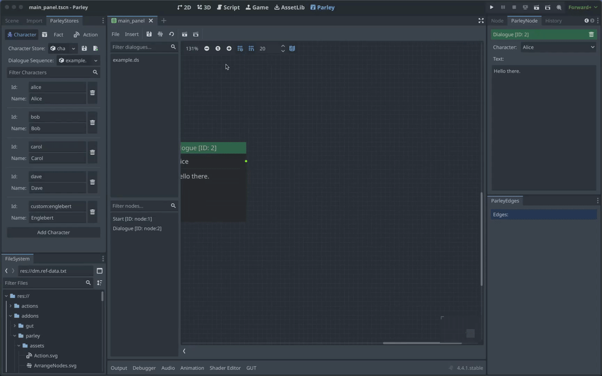

An End Node defines the end of the Dialogue Sequence. Although Dialogue
Sequences do not require the presence of End Nodes to end a running Dialogue
Sequence, it is recommended to do so to make it clear to the Dialogue Sequence
writer that reaching this Node ends the currently open dialogue. You can find
all sorts of Dialogue Sequence examples in the Parley
[`examples`](https://github.com/bisterix-studio/parley/tree/main/examples)
folder.

## Prerequisites

- Ensure you have familiarised yourself with the
  [End Node](../nodes/end-node.md) docs.
- Parley is [installed](./installation.md) and running in your Godot Editor.
- You have created a basic Dialogue Sequence before. Consult the
  [Getting Started guide](./create-dialogue-sequence.md) for more info.

## Instructions

1. Create a End Node using the `Insert` dropdown.
2. Click on the created End Node in the graph view to open up the End Node
   Editor.
3. Click the `Save` button in the Parley Editor and there we have it! Our first
   End Node.
4. Now connect this Node up with other Nodes to terminate the Dialogue Sequence
   and ensure it can be ended when this Node is reached.
5. You can test out your Dialogue Sequence by clicking the Test Dialogue
   Sequence from beginning button.
