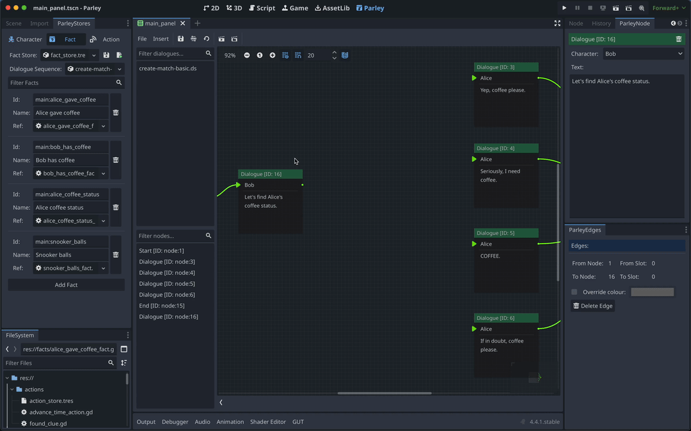

A Match Node is useful for selecting the next Node based on the well-known value
of a variable or expression. You can find all sorts of Dialogue Sequence
examples in the Parley
[`examples`](https://github.com/bisterix-studio/parley/tree/main/examples)
folder.

## Prerequisites

- Ensure you have familiarised yourself with the
  [Match Node](../nodes/match-node.md) docs.
- Parley is [installed](./installation.md) and running in your Godot Editor.
- You have followed the [instructions](./register-fact.md) to add the relevant
  facts to the system. Make sure you create a Fact with well-known values.
- You have created a basic Dialogue Sequence before. Consult the
  [Getting Started guide](./create-dialogue-sequence.md) for more info.

## Instructions

1. Create a Match Node using the `Insert` dropdown.
2. Click on the created Match Node in the graph view to open up the Match Node
   Editor.
3. Enter a high-level descriptive name for what the Match Node represents. This
   is because it can be sometimes hard to work out what matches are doing so the
   more info you can provide up front the better! In this example, we write:
   `Alice coffee status`.
4. Select a Fact using the dropdown. In this case, we will select the
   `Snooker balls` Fact. Facts are manually defined scripts that execute when a
   match is evaluated and return a value to be checked later in the match. These
   also define well-known values that are used to select against.

> [tip]: You can click on the pencil icon to the right of the Fact to view the
> selected Fact in the Godot GDScript Editor and optionally edit it.

5. Now choose your cases you want to select against. Here we will choose all of
   the available cases including the fallback case. This means that even if we
   don't select on a case, the fallback will be chosen as the next path.
6. Click the `Save` button in the Parley Editor and there we have it! Our first
   Match Node.
7. You can test out your Dialogue Sequence by clicking the Test Dialogue
   Sequence From Start Button.
