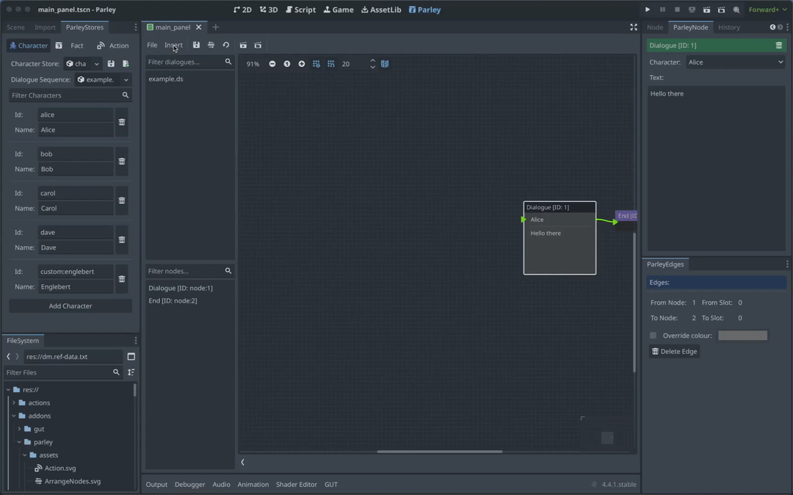

A Start Node defines the start of the Dialogue Sequence. For a Dialogue Sequence
to be valid and run and runtime, there must be one and only one Start Node
defined. You can find all sorts of Dialogue Sequence examples in the Parley
`examples` folder.

## Pre-requisites

- Familiarise yourself with the [Start Node](../concepts/start-node.md) docs.
- Parley is installed and running in your Godot Editor.
- You have created a basic Dialogue Sequence before. Consult the
  [getting started guide](./create-dialogue-sequence.md) for more info.

## Instructions

1. Create a Start Node using the `Insert` dropdown.
2. Click on the created Start Node in the graph view to open up the Start Node
   Editor.
3. Click the `Save` button in the Parley editor and there we have it! Our first
   Start Node.
4. Now connect this Node up with other Nodes to continue the Dialogue Sequence
   and ensure it can be started.
5. You can test out your Dialogue Sequence by clicking the Test Dialogue
   Sequence from start button.
