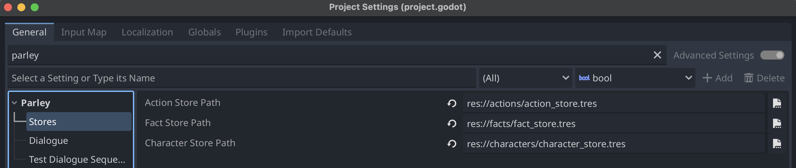

You can download Parley directly or install it from the Asset Lib in the Godot
Editor.

## Pre-requisites

- [Godot 4.4+](https://godotengine.org/) is installed.

## Instructions

### Installing from the Godot Asset Lib within the editor

1. Select the AssetLib button at the top of the Godot editor.
2. Search for `Parley` in the search box
3. Select the Parley plugin.
4. Click `Install`. This will kick off the download.
5. Voila!

Complete the first time installation by following the
[instructions](#first-time-installation) below.

## Download and install

<!-- TODO: correct the link -->

Download the compressed zip file from the
[Parley releases page on GitHub](https://github.com/bisterix-studio/parley/releases)
or from the
[Godot Asset Library](https://godotengine.org/asset-library/asset/TODO).

Extract the compressed zip file and place the `parley` directory into your
`addons` directory in your project.

Complete the first time installation by following the
[instructions](#first-time-installation) below.

### First-time installation

When you install Parley for the first time, the following stores will need to be
set-up, otherwise you will receive some warnings in the editor:

- Action store
- Fact store
- Character store

To resolve these warnings, create the following resources in the Godot editor
and for each, fill out the fields as appropriate.

> [warn]: You don't need to add items to them at this point, you will be able to
> do this via the respective store editor.

| Resource               | Store           |
| ---------------------- | --------------- |
| `ParleyFactStore`      | Fact Store      |
| `ParleyActionStore`    | Action Store    |
| `ParleyCharacterStore` | Character Store |

Then, from the menu choose Project -> Project Settings, search for `Parley` in
the settings and set the following settings with the files you created above:

- `Action Store Path`
- `Fact Store Path`
- `Character Store Path`

Your settings should look like the following:

<!-- TODO: move up -->

### Activate

1. From the menu choose Project->Project Settings, click the Plugins tab and
   activate Plugin. Once activated, the Parley will appear at the top of your
   editor:

<!-- TODO: fix -->

<!-- ### Setup stores -->
