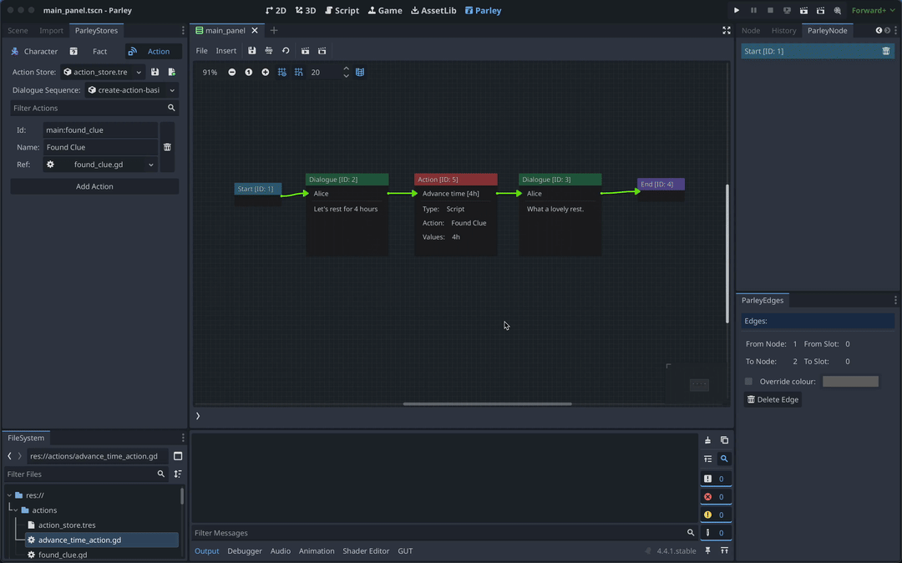

Actions are resources in Parley used to execute defined functionality during the
running of a Dialogue Sequence. For example, an Action could contain
functionality to: emit a signal, register a journal entry, or update state.

Actions are stored in an Action Store which can be configured in the Parley
settings.

In this guide, we will create an action that can be used to create an Action
Node in the corresponding
[create an Action Node guide](./create-action-node.md).

## Prerequisites

- Ensure you have familiarised yourself with the
  [Action Node](../nodes/action-node.md) docs.
- Parley is [installed](./installation.md) and running in your Godot Editor.
- You have created a basic Dialogue Sequence before. Consult the
  [Getting Started guide](./create-dialogue-sequence.md) for more info.

## Instructions



> [info]: it is assumed that the default Parley settings are used for the Action
> Store and it is stored at: `res://actions/action_store_main.tres`. You can
> find more information on changing the default Parley settings
> [here](../reference/parley-settings.md).

1. Create an Action script (ensure that it extends the `ParleyActionInterface`
   class) at: `res://actions/advance_time_action.gd`

```gdscript
extends ParleyActionInterface

func execute(_ctx: ParleyContext, values: Array) -> int:
	print("Advancing time by %s" % [values[0]])
	return OK
```

2. Open up the `ParleyStores` dock in the Godot Editor and open the `Action`
   tab.
3. Click `Add Action`.
4. Give your new action an ID. In our example, we use: `main:advance_time`.
5. Give your new action a name. In our example, we use: `Advance Time`.
6. Link your created action script with the Action using the resource inspector
   (labelled `Ref`).

> [tip]: You can use the resource Editors in `ParleyStores` to quickly navigate
> to the relevant resource for editing. You can also add resources using the
> resource Editor dropdown field instead of dragging.

7. You should now see that the Action is available in the Action dropdown
   options in the Action Node Editor. Select `Advance Time` in the options to
   associate it with the selected Action Node.
8. Test out your new Action within the Dialogue Sequence by clicking the Test
   Dialogue Sequence From Start Button.
