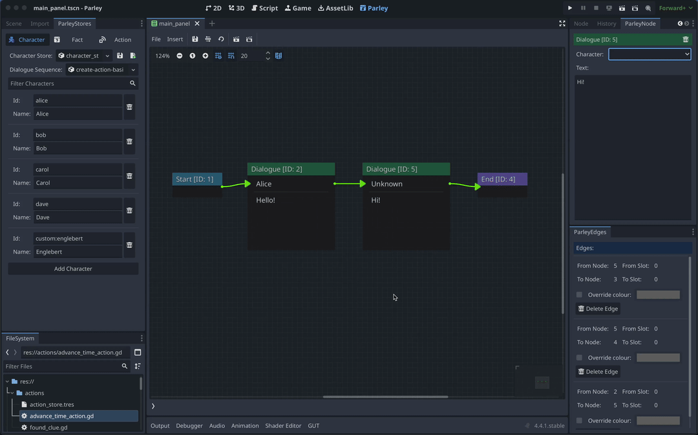

As the name suggests, Characters are resources in Parley used to define
characters within a Dialogue Sequence.

Characters are stored in a Character Store which can be configured in the Parley
settings.

In this guide, we will create a character that can be used to create
[Dialogue](../nodes/dialogue-node.md) and
[Dialogue Option](../nodes/dialogue-option-node.md) nodes.

## Pre-requisites

- Ensure you have familiarised yourself with the
  [Character Node](../nodes/character.md) docs.
- Parley is [installed](./installation.md) and running in your Godot Editor.
- You have created a basic Dialogue Sequence before. Consult the
  [getting started guide](./create-dialogue-sequence.md) for more info.

## Instructions

> [info]: it is assumed that the default Parley settings are used for the
> character store and it is stored at:
> `res://characters/character_store_main.tres`. You can find more information on
> changing the default Parley settings [here](../reference/parley-settings.md).

1. Open up the `ParleyStores` dock in the Godot Editor and open the `Character`
   tab.
2. Click `Add Character`.
3. Give your new character an ID. In our example, we use: `frankie`.
4. Give your new character a name. In our example, we use: `Frankie`.

> [tip]: You can use the resource editors in `ParleyStores` to quickly navigate
> to the relevant resource for editing. You can also add resources using the
> resource editor dropdown field instead of dragging.

5. You should now see that the Character is available in the Dialogue node
   dropdown options for the associated character. Select `Frankie` in the
   options to associate it with the selected Dialogue Node.
6. Test out your new Character within the Dialogue Sequence by clicking the Test
   Dialogue Sequence from start button.

> [tip]: You may want to define a custom character rather than using the Parley
> Character so you can add custom attributes. ATM, Parley does not support
> adding this via the `ParleyStores` editor but you can do by adding to the raw
> character store resource in the Godot editor. When doing this, it is **vital**
> to ensure that you include `@tool` at the top of the your custom character
> definition.
