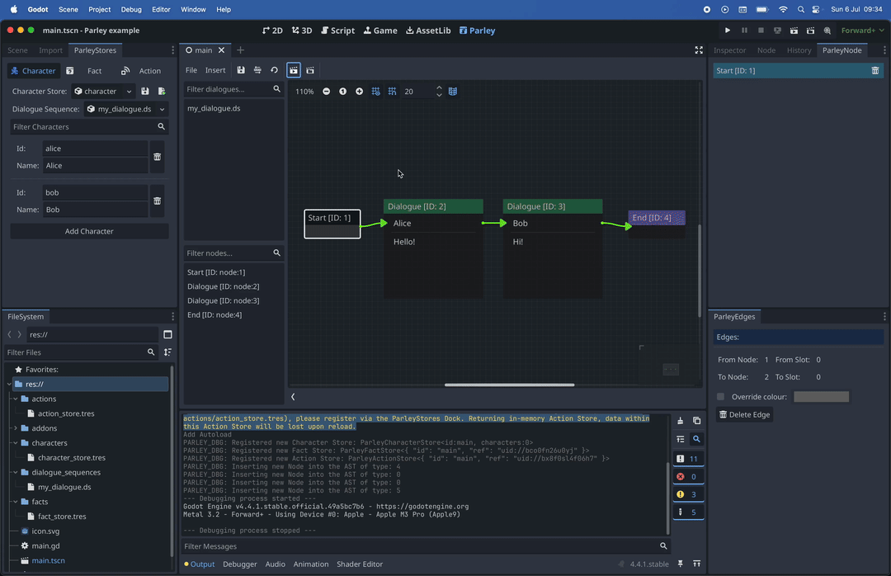

Once you have built a Dialogue Sequence, you will of course want to run this
within your game. After all, what are we here for if not making and playing
games! This guide will show you how to run a Dialogue Sequence and implement
within your game. For creating a Dialogue Sequence, please refer to the
[Create a Dialogue Sequence guide](./create-dialogue-sequence.md).

## Prerequisites

- Ensure you have familiarised yourself with the
  [key Parley concepts](../concepts/architecture.md).
- Parley is [installed](./installation.md) and running in your Godot Editor.
- You have an available Dialogue Sequence ready to be used and have created a
  basic Dialogue Sequence before. If not, please consult the
  [Getting Started guide](./create-dialogue-sequence.md) for more info.
- You already have a Scene created for displaying your Dialogue Sequence in and
  this scene is associated with a script. At its most basic level, this can
  simply be an empty `Node` scene and an empty associated script. In our
  example, we use:
  - `main.tscn`
  - `main.gd`

## Instructions



> [tip]: If you'd like to access and follow along using the supporting video
> instead, please find the original mp4
> [here](https://github.com/bisterix-studio/parley/blob/main/www/static/docs/run-dialogue-sequence/run-dialogue-sequence.mp4).

1. Open your Scene script in the Godot Editor and load your Dialogue Sequence
   with the following code:

```gdscript
const basic_dialogue: ParleyDialogueSequenceAst = preload("res://dialogue_sequences/my_dialogue.ds")
```

2. Then, in the `_ready` lifecycle method, trigger the start of the Dialogue
   Sequence processing using the `Parley` autoload with the following code:

```gdscript
func _ready() -> void:
  # Trigger the start of the Dialogue Sequence processing using the Parley autoload
	var _result: Node = Parley.start_dialogue({}, basic_dialogue)
```

3. And that's it! Your script should look something like:

```gdscript
extends Node

const basic_dialogue: ParleyDialogueSequenceAst = preload("res://dialogue_sequences/my_dialogue.ds")

func _ready() -> void:
  # Trigger the start of the Dialogue Sequence processing using the Parley autoload
	var _result: Node = Parley.start_dialogue({}, basic_dialogue)
```

> [tip]: If you would like to customise the running of Parley Dialogue Sequences
> yourself, you can use the following as a reference:
>
> - [`ParleyRuntime`](https://github.com/bisterix-studio/parley/blob/main/addons/parley/parley_runtime.gd)
> - [`ParleyDefaultBalloon`](https://github.com/bisterix-studio/parley/blob/main/addons/parley/components/default_balloon.gd)
>   (this is configurable in the
>   [Parley settings](../reference/parley-settings.md))
>
> Please note, more information on this and in-built support for customisation
> will covered in a future release.

4. Either run your game by clicking the `Run Project` button in the top right of
   your Editor or run the current scene by clicking the `Run Current Scene` in
   the top right of your Editor.
5. And voila! You have now fully integrated Parley with your game!
