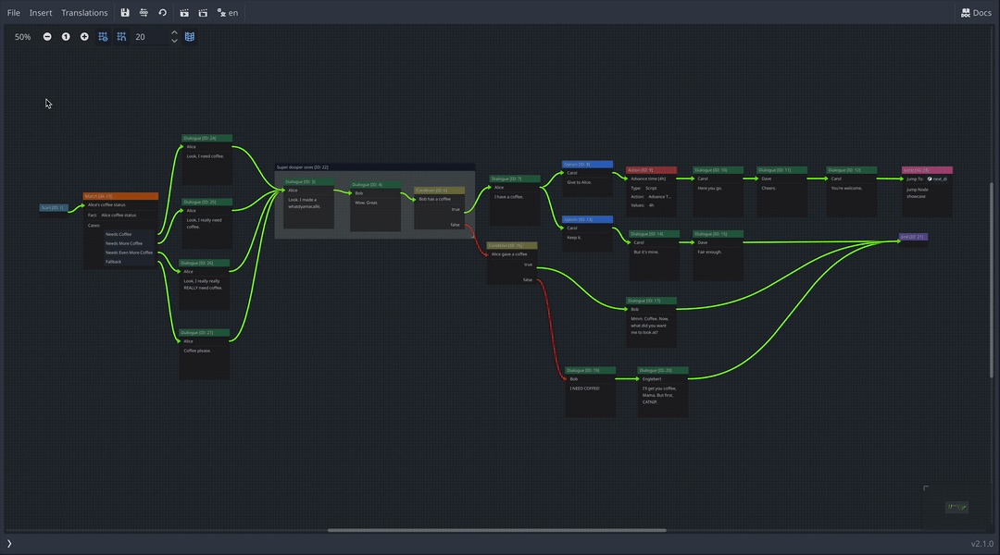
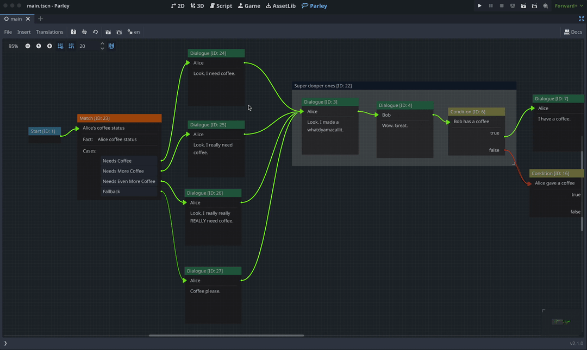
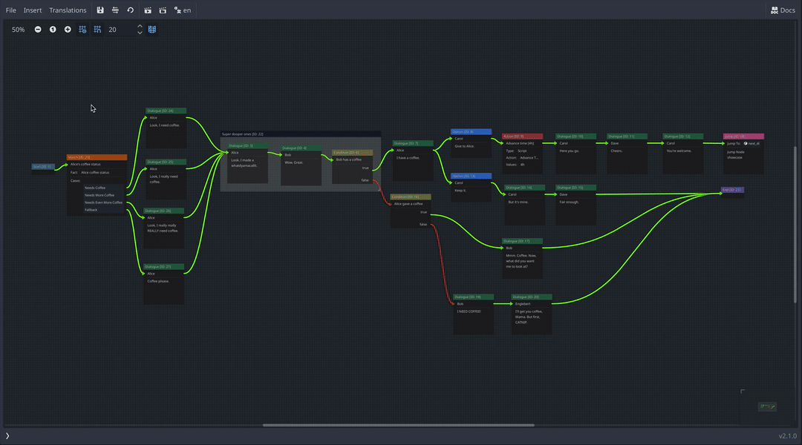

Parley supports multiple ways of handling translations for your game:

- Using [CSV files](../internationalisation/localisation-using-csv.md). This
  corresponds to `CSV` translation mode.
- Using [GNU gettext](../internationalisation/localisation-using-gettext.md).
  This corresponds to `PO` translation mode.

Setting the translation mode can be set in the
[Parley settings](../reference/parley-settings.md). By default, any created
`ParleyContext` will use this setting to infer the translation mode. However, it
can be overridden as follows:

```gdscript
func _ready() -> void:
	var data: Dictionary = {}
	var translation_mode: TranslationMode = TranslationMode.CSV # Override the settings by providing as an argument to the ParleyContext factory
	ctx = ParleyContext.create(basic_dialogue, data, translation_mode)

	# Trigger the start of the Dialogue Sequence processing using the Parley autoload
	var _result: Node = Parley.run_dialogue(ctx, basic_dialogue)
```

## Text translations

By default, Parley will detect the current translation mode and attempt to
translate defined text in using the unbuilt Godot `tr` function for the
following nodes:

- [Dialogue Node](../nodes/dialogue-node.md)
- [Dialogue Option Node](../nodes/dialogue-option-node.md)

> [tip]: You can select the modes that Parley will run under, and if needed,
> turn off translation support in Parley in the Parley project
> [settings](../reference/parley-settings.md).

If Parley is unable to detect the current translation mode, it will default to
CSV mode.

Each translation mode translates the text slightly differently. You can find
more information in the docs for each:

- Using [CSV files](../internationalisation/localisation-using-csv.md).
- Using [GNU gettext](../internationalisation/localisation-using-gettext.md).

### Exporting Text translations

Parley supports exporting all text translations for the currently opened
Dialogue Sequence via the Translations menu.



More information about the exported CSV can be found
[here](./localisation-using-csv.md).

When an exported file exists, Parley will merge the exported translations with
the following rules:

1. Existing locale keys will be retained.
2. The inferred Node translation key will be used for the `keys` column.
3. If a new translation row is added, the Node text value will be added for each
   locale.
4. If an existing row is detected, and the Node text for the project locale
   (e.g. the `en` column) is the same, the row will be left as is.
5. If an existing row is detected, and the Node text for the project locale is
   different, the row will be reset and treated like a new row (see new row rule
   above).

When an exported file does not exist, Parley will output the exported
translations as follows:

1. Locale keys will be added for each project locale currently loaded.
2. If none are loaded then the only the project locale will be included
   alongside the translation key.
3. The inferred Node translation key will be used for the `keys` column.
4. The Node text value will be added for each locale

### Importing Dialogue Text Translations

Parley supports importing all text translations for the currently opened
Dialogue Sequence via the Translations menu.



When importing, the `keys` field (or whatever this is set to in
[Parley settings](../reference/parley-settings.md)) within the CSV import is
used to identify matching Dialogue or Dialogue Option Nodes.

If a match is identified, the text field will be updated. Otherwise, the
translation row will imported as a translation into the project but ultimately
ignored by the current Dialogue Sequence.

In addition, if a row key is different to the project locale entry of a CSV
import (e.g. the `en` column value), this Parley will set the
`text_translation_key` field to the key of the CSV import row.

> [tip]: When importing translations to Parley via CSV, it is highly recommended
> to use text Translation Keys. These can be configured in the Parley Node
> Editor or set for every Node in a Dialogue Sequence by clicking the
> `Translations` -> `Generate Text Translation Keys...` button in the Parley
> plugin view.

As an example, let's say we have the following CSV to import containing updated
text fields:

```csv
keys,en
I have a coffee.,I have a coffee.
Can I have your coffee.,Can I have your coffee please.
GIVE_TO_ALICE,Give to Alice please.
```

And the following Dialogue Sequence:

```json
{
  "nodes": [
    {
      "id": "node:1",
      "text": "I have a coffee.",
      "text_translation_key": ""
      // ...
    },
    {
      "id": "node:2",
      "text": "Can I have your coffee.",
      "text_translation_key": ""
      // ...
    },
    {
      "id": "node:3",
      "text": "Give to Alice.",
      "text_translation_key": "GIVE_TO_ALICE"
    }
    // ...
  ]
  // ...
}
```

Upon import, this will be changed as follows:

```diff
{
  "nodes": [
    {
      "id": "node:1",
      "text": "I have a coffee.",
      "text_translation_key": ""
      // ...
    },
    {
      "id": "node:2",
-      "text": "Can I have your coffee.",
+      "text": "Can I have your coffee please.",
-      "text_translation_key": ""
+      "text_translation_key": "Can I have your coffee."
      // ...
    },
    {
      "id": "node:3",
-      "text": "Give to Alice.",
+      "text": "Give to Alice please.",
      "text_translation_key": "GIVE_TO_ALICE"
    }
    // ...
  ]
  // ...
}
```

More information about the imported CSV can be found
[here](./localisation-using-csv.md).

## Character translations

Parley makes the assumption that character translations are handled separately
to Parley because they are used in more than just dialogue. As a result, the
default Parley balloon tries to translate the character name directly with a
specific context of `DIALOGUE` to avoid any unexpected clashes.

For example, in the default Dialogue Container
(`addons/parley/components/dialogue/dialogue_container.gd`), this is implemented
as follows:

```gdscript
func _render() -> void:
	if dialogue_text_label:
		var character: ParleyCharacter = dialogue_node.resolve_character()
		# Note the `DIALOGUE` translation context
		dialogue_text_label.text = "[b]%s[/b] – %s" % [tr(character.name if character.name != '' else 'Unknown', 'DIALOGUE'), dialogue_node.text]
```

### Exporting Character Name translations

Parley supports exporting all Character names for the currently opened Dialogue
Sequence via the Translations menu.



## Determining the locale of Dialogue Sequences

There are several different contexts where the locale is determined for Dialogue
Sequences:

- Writing
- Testing
- Running

### Locale when writing Dialogue Sequences

When **writing** Dialogue Sequences, the locale that is used for translation
values is determined in the following order:

1. Use the `parley/test_dialogue_sequence/default_locale` project setting, if
   defined.
2. If the above is not set, then the `internationalization/locale/fallback`
   project setting is used, if defined.
3. If the above is not set, then the Godot editor system locale is used.

### Locale when testing Dialogue Sequences

When **testing** Dialogue Sequences, the locale used for testing is determined
in the following order:

1. Use the `parley/test_dialogue_sequence/locale`, if defined. This can be set
   in the main Parley view, by the button next to the `Translations` menu.
2. Use the `parley/test_dialogue_sequence/default_locale` project setting, if
   defined.
3. If the above is not set, then the `internationalization/locale/fallback`
   project setting is used, if defined.
4. If the above is not set, then the Godot editor system locale is used.

### Locale when running Dialogue Sequences

When **running** Dialogue Sequences:

Determined in the following order:

1. Just what the translation server is currently set to for the user playing the
  game.
