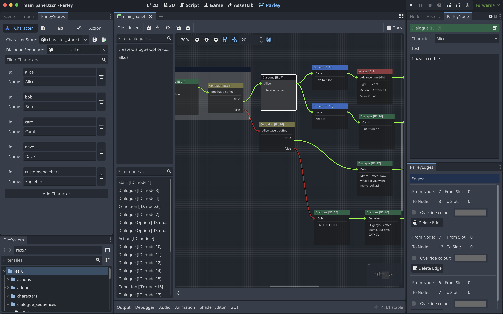

Parley is an addon for [Godot 4.4+](https://godotengine.org/) that provides a
graph-based dialogue manager for easy writing, testing, and running of dialogue
sequences at scale and is designed to be used by game writers and developers
alike.

Write your dialogue sequences by defining the graph for your dialogue sequence
which are backed by a well-defined Dialogue AST for easy management and
integration within your game.

You can install it via the Asset Library or
[downloading a copy](https://github.com/bisterix-studio/parley/archive/refs/heads/main.zip)
from GitHub.

Some stand out features:

- An easy to use and well-defined Graph Editor
- A wide variety of nodes for maximum flexibility and creativity:
  - [Dialogue](../nodes/dialogue-node.md)
  - [Dialogue Option](../nodes/dialogue-option-node.md)
  - [Condition](../nodes/condition-node.md)
  - [Match](../nodes/match-node.md)
  - [Action](../nodes/action-node.md)
  - [Group](../nodes/group-node.md)
  - [Start](../nodes/start-node.md)
  - [End](../nodes/end-node.md)
- Creation of connections between nodes to easily see the flow of your dialogue
  sequence
- Easy testing of your dialogue at any stage in the sequence
- Well-defined Dialogue AST for easy review and management of Dialogue Sequences
- Character store for management of characters in Dialogue and Dialogue Options
- Action store for management of actions for use with Action nodes
- Fact store for management of facts for use with Condition and Match nodes
- An out of the box dialogue balloon to get started straight away
- Easy management of your dialogue sequences, including node filtering
- Export your Dialogue passages to CSV

## License

Parley is 100% free and open-source, under the MIT licence.
[The license is distributed with Parley and can be found in the `addons/parley` folder](https://github.com/bisterix-studio/parley/blob/main/addons/parley/LICENSE).

## Contributions

[Contributions](https://github.com/bisterix-studio/parley/blob/main/CONTRIBUTING.md),
issues and feature requests are very welcome. If you are using this package and
fixed a bug for yourself, please consider submitting a PR!
