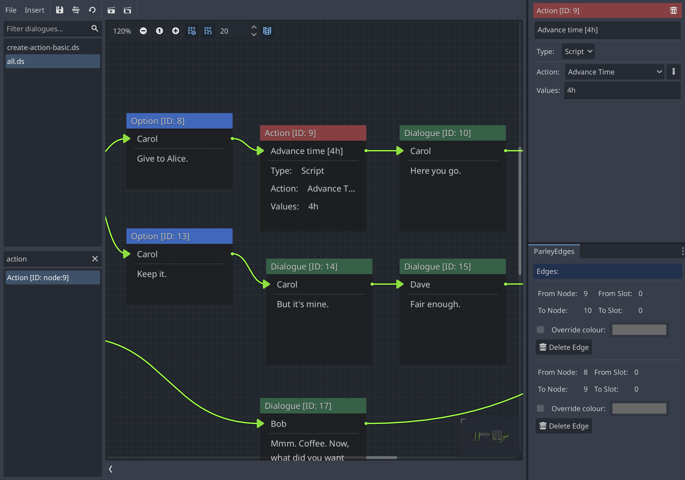

An Action Node gives the ability to execute functionality during the processing
of a Dialogue Sequence. For example, emitting a signal, registering a journal
entry, or updating state.



They have the following characteristics:

## Description

A human-readable description of the Action Node to aid future understanding of
the Node at a quick glance.

## Type

The type of the Action Node. This defines how the Action Node will be executed.
Supported types are:

- `Script` - the script associated with the Action Node will be executed when
  the Node is processed during the Dialogue Sequence. This is the most flexible
  way of defining Action Nodes.

## Action Script

The action script to execute when the Action Node is processed. These are stored
in the Action Store.

Valid action scripts must implement the `ParleyActionInterface` by providing an
`execute` method. For example:

```gdscript Example Action Script
func execute(ctx: ParleyContext, values: Array) -> int:
  print("Advancing time by %s" % [values[0]])
  ctx.get('advance_time').emit(values[0])
  return OK
```

The `ctx` parameter contains the context passed throughout the processing of the
Dialogue Sequence. This is useful to attach state to that can be used by the
Action Script processing.

The [`values`](#values) parameter is defined on the Action Node itself and
provided as-is to the action script.

## Values

The array of values passed to the Action Script. This is useful for providing
specific overrides and information to the Action Script for the defined Node. At
the moment, these are passed as a string and must be parsed within the Action
Script itself. For example: `4h`.
