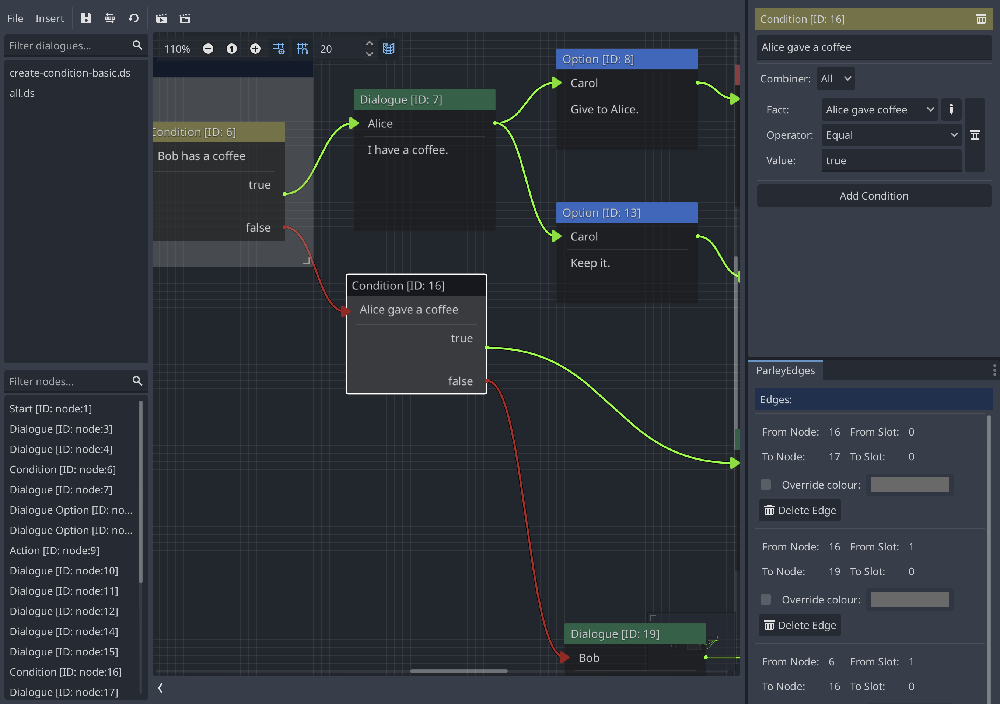
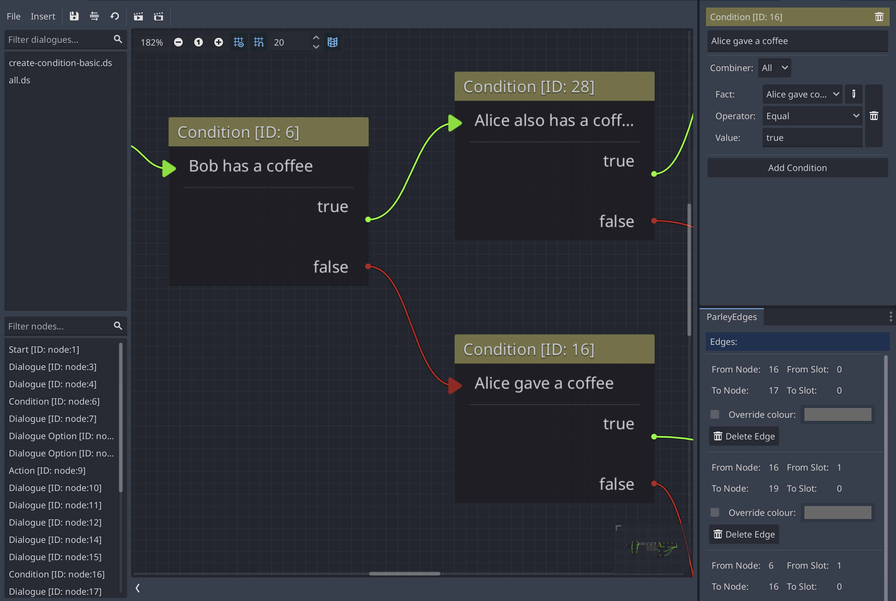

A Condition Node is useful for selecting the next node based on the result of a
combination of conditions. They are a key part of Dialogue Sequences, allowing
one to conditionally direct a player through a Dialogue Sequence graph. For
example, deciding which dialogue response to render or choosing whether to
render a dialogue option (or not).

The output of a Condition Node determines whether the check passed or not. These
are:

- `true` (green path) - the check passed.
- `false` (red path) - the check failed.

They have the following characteristics:

## Description

A human-readable description of the condition node to aid future understanding
of the node at a quick glance.

## Combiner

The combiner determines whether the combination of conditions pass the overall
condition check or not. At the moment, Parley supports the following combiners:

- `ALL` - All of the defined conditions must pass for the condition node check
  to pass (a.k.a return `true` (green path)).
- `ANY` - Any one of the defined conditions must pass for the condition node
  check to pass (a.k.a return `true` (green path)). If some fail, the check will
  still pass provided that one of the conditions has passed.

## Conditions

The conditions to evaluate for the condition node. Each condition contains a
fact that is compared and they are evaluated and used in conjunction with the
combiner to determine whether a condition node check has passed or not. See the
[scenarios](#-scenarios-1) for some examples.

Each condition has the following characteristics:

### Fact Ref

The fact to evaluate for the condition node. These are stored in the fact store
and at runtime are evaluated for comparison using the defined operator and
value.

You can think of a fact as something that is exactly what it says on the tin, a
fact. For example, a fact could be: `Alice gave a coffee`. This fact represents
whether Alice gave a coffee or not. If this fact evaluated to `true` during the
running of Parley, then we can say: Alice did indeed give a coffee. However, if
the fact evaluated to `false`, then we can say: Alice did not give a coffee.

To find out how to define and register a fact, please follow the guide
[here](../getting-started/register-fact.md).

### Operator

As its name suggests, the operator used to compare the result of a fact against
the defined value. The following operators are supported:

- `EQUAL` - whether the fact equals the value
- `NOT_EQUAL` - whether the fact does not equal the value

### Value

The value to compare against the output of the fact using the operator above.

> [tip]: The value will be coerced to match the output type of the evaluated
> fact where possible. For example, if the fact evaluates to an integer: 2, a
> value of `3` will be coerced to an integer of `3` for comparison.

## Scenarios

Below is a list of common scenarios to help you understand how condition nodes
work.

### Scenario 1

Let's say the condition node is defined as follows:

Combiner: `ALL`

Conditions:

- Condition 1:
  - Fact: `alice_gave_coffee`
  - Operator: `EQUAL`
  - Value: `true`

When the fact `alice_gave_coffee` evaluates to `true`

The condition node evaluates to `true` and the Dialogue Sequence continues down
the `true` (green) path only.

### Scenario 2

Let's say the condition node is defined as follows:

Combiner: `ALL`

Conditions:

- Condition 1:
  - Fact: `alice_gave_coffee`
  - Operator: `EQUAL`
  - Value: `true`

When the fact `alice_gave_coffee` evaluates to `false`

The condition node evaluates to `false` and the Dialogue Sequence continues down
the `false` (red) path only.

### Scenario 3

Let's say the condition node is defined as follows:

Combiner: `ALL`

Conditions:

- Condition 1:
  - Fact: `alice_gave_coffee`
  - Operator: `EQUAL`
  - Value: `true`
- Condition 2:
  - Fact: `bob_has_coffee`
  - Operator: `EQUAL`
  - Value: `true`

When the fact `alice_gave_coffee` evaluates to `true` and the fact
`bob_has_coffee` evaluates to `true`

The condition node evaluates to `true` and the Dialogue Sequence continues down
the `true` (green) path only.

### Scenario 4

Let's say the condition node is defined as follows:

Combiner: `ALL`

Conditions:

- Condition 1:
  - Fact: `alice_gave_coffee`
  - Operator: `EQUAL`
  - Value: `true`
- Condition 2:
  - Fact: `bob_has_coffee`
  - Operator: `EQUAL`
  - Value: `true`

When the fact `alice_gave_coffee` evaluates to `true` and the fact
`bob_has_coffee` evaluates to `false`

The condition node evaluates to `false` and the Dialogue Sequence continues down
the `false` (red) path only.

### Scenario 5

Let's say the condition node is defined as follows:

Combiner: `ANY`

Conditions:

- Condition 1:
  - Fact: `alice_gave_coffee`
  - Operator: `EQUAL`
  - Value: `true`
- Condition 2:
  - Fact: `bob_has_coffee`
  - Operator: `EQUAL`
  - Value: `true`

When the fact `alice_gave_coffee` evaluates to `true` and the fact
`bob_has_coffee` evaluates to `true`

The condition node evaluates to `true` and the Dialogue Sequence continues down
the `true` (green) path only.

### Scenario 6

Let's say the condition node is defined as follows:

Combiner: `ANY`

Conditions:

- Condition 1:
  - Fact: `alice_gave_coffee`
  - Operator: `EQUAL`
  - Value: `true`
- Condition 2:
  - Fact: `bob_has_coffee`
  - Operator: `EQUAL`
  - Value: `true`

When the fact `alice_gave_coffee` evaluates to `true` and the fact
`bob_has_coffee` evaluates to `false`

The condition node evaluates to `true` and the Dialogue Sequence continues down
the `true` (green) path only. (Note the `ANY` combiner here).

### Scenario 7

Let's say the condition node is defined as follows:

Combiner: `ALL`

Conditions:

- Condition 1:
  - Fact: `alice_hit_points`
  - Operator: `EQUAL`
  - Value: `0`

When the fact `alice_hit_points` evaluates to `1`

The condition node evaluates to `false` and the Dialogue Sequence continues down
the `false` (red) path only.

### Scenario 8

Let's say the condition node is defined as follows:

Combiner: `ALL`

Conditions:

- Condition 1:
  - Fact: `alice_hit_points`
  - Operator: `NOT_EQUAL`
  - Value: `0`

When the fact `alice_hit_points` evaluates to `1`

The condition node evaluates to `true` and the Dialogue Sequence continues down
the `true` (green) path only.

## Advanced usage

### Nesting condition nodes

In more complex conditional cases, one may want to nest a series of conditions.
To achieve this in Parley, you can nest the condition nodes together by
connecting the output edges to the input of the nested condition nodes. For
example:

