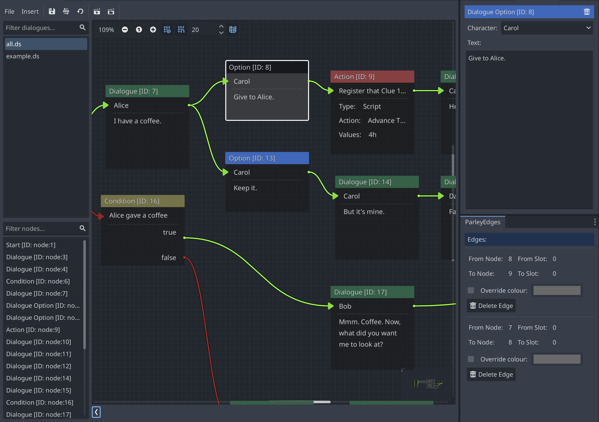

A Dialogue Node defines a series of options presented to the player within the
Dialogue Sequence. The Dialogue Sequence will branch off each option, making it
one of the key components of the branching dialogue system.

They are individually associated with a character which can be used to enhance
the displayed Dialogue Options.

They have the following characteristics:

## Character

The character associated with the Dialogue Option Node. These are stored in the
Character Store and determine the available characters that can be used to
select against.

## Text

The text of the Dialogue Option. For example, something that the player says to
a character.

> [tip]: The text input supports Godot
> [BBCode](https://docs.godotengine.org/en/stable/tutorials/ui/bbcode_in_richtextlabel.html)
> which can be used to enhance the look of your displayed dialogue.
