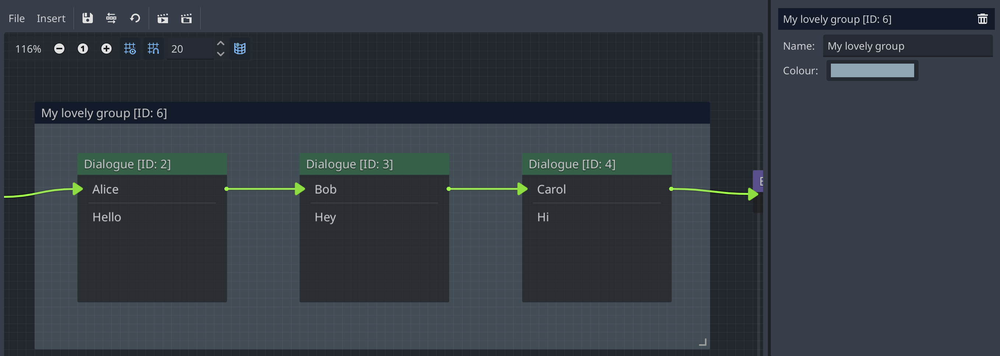

As its name suggests, a Group Node gives the ability to group Nodes that fall
within its boundary in the Parley Dialogue Sequence graph view. This is designed
to aid organisation of large Dialogue Sequences where Nodes that are part of the
same group will be moved when the Group Node moves.

As the description implies, a group Node is only applicable during game
development rather than run-time.

They have the following characteristics:

## Name

The name of the Group Node. Try and keep it as descriptive as possible to help
identify what the group represents!

## Colour

The background colour of the Group Node. This helps distinguish different group
Nodes from each other.
