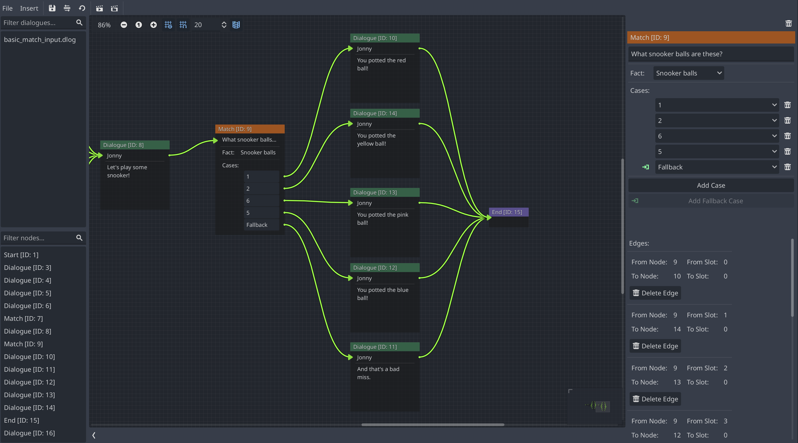

A Match Node is useful for selecting the next Node based on the well-known value
of a variable or expression.

They have the following characteristics:

## Description

A human-readable description of the match Node to aid future understanding of
the Node at a quick glance.

## Fact

The Fact to evaluate for the match Node. These are stored in the Fact Store and
determine the available cases that can be used to select against.

## Cases

The values that are selected against. For example, if a Fact evaluates to a
values of `WAVE` and there is a case called `WAVE`, then these will match. If a
Node a Node is connected to this case, then this will be next Node that is
processed as part of the Dialogue Sequence.

Parley also supports a fallback case for when nothing is matched. This is useful
to ensure the dialogue can continue in these cases. However, it is optional as
one might not want a fallback case in these situations.
