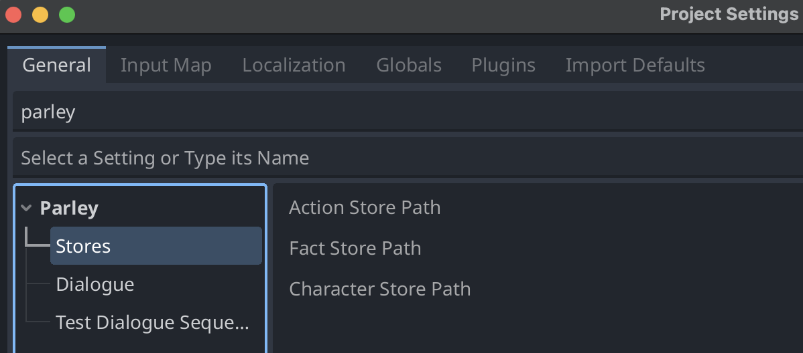

Parley supports the following settings should you want to tweak some of the
default behaviours.

To access all the Parley settings, open up the Godot settings: `Project` ->
`Project Settings` and filter by: `parley`:

## Action Store Path

This defines the path to the Action Store resource that is used to store
actions. The resource extend resource type: `ParleyActionStore`.

> [warn]: This path must be valid in order for Parley to function properly.

Setting path: `parley/stores/action_store_path`

Default: `res://actions/action_store.tres`

## Fact Store Path

This defines the path to the Fact Store resource that is used to store facts.
The resource extend resource type: `ParleyFactStore`.

> [warn]: This path must be valid in order for Parley to function properly.

Setting path: `parley/stores/fact_store_path`

Default: `res://facts/fact_store.tres`

## Character Store Path

This defines the path to the Character Store resource that is used to store
characters. The resource extend resource type: `ParleyCharacterStore`.

> [warn]: This path must be valid in order for Parley to function properly.

Setting path: `parley/stores/character_store_path`

Default: `res://characters/character_store.tres`

## Dialogue Balloon Path

This defines the path to the default Dialogue balloon that is used to render the
dialogue when testing Dialogue Sequences.

Setting path: `parley/dialogue/dialogue_balloon_path`

Default: `res://addons/parley/components/default_balloon.tscn`

## Test Scene Path

This defines the path to the default test scene that is rendered when testing
Dialogue Sequences.

Setting path: `parley/test_dialogue_sequence/test_scene_path`

Default: `res://addons/parley/views/test_dialogue_sequence_scene.tscn`
