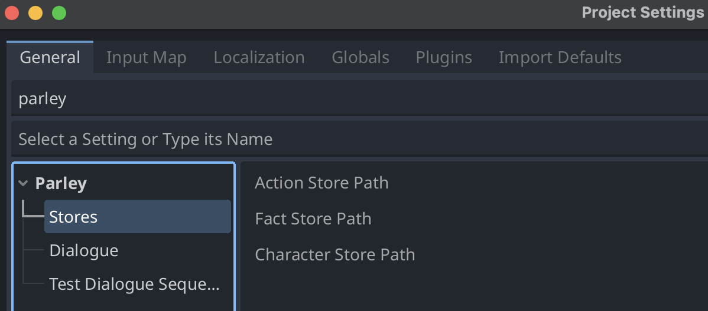

Parley supports the following settings should you want to tweak some of the
default behaviours.

To access all the Parley settings, open up the Godot settings: `Project` ->
`Project Settings` and filter by: `parley`:

## Stores

### Action Store Path

Defines the path to the Action Store resource that is used to store actions. The
resource extends resource type: `ParleyActionStore`.

> [warn]: This path must be valid in order for Parley to function properly.

Setting path: `parley/stores/action_store_path`

Default: `res://actions/action_store.tres`

### Fact Store Path

Defines the path to the Fact Store resource that is used to store facts. The
resource extends resource type: `ParleyFactStore`.

> [warn]: This path must be valid in order for Parley to function properly.

Setting path: `parley/stores/fact_store_path`

Default: `res://facts/fact_store.tres`

### Character Store Path

Defines the path to the Character Store resource that is used to store
characters. The resource extends resource type: `ParleyCharacterStore`.

> [warn]: This path must be valid in order for Parley to function properly.

Setting path: `parley/stores/character_store_path`

Default: `res://characters/character_store.tres`

## Dialogue

### Dialogue Balloon Path

Defines the path to the default Dialogue balloon that is used to render the
dialogue when testing and running Dialogue Sequences.

Setting path: `parley/dialogue/dialogue_balloon_path`

Default: `res://addons/parley/components/default_balloon.tscn`

## Internationalisation

### Translation Mode

Defines the translation mode to determine how to find and interpret
translations. It can be one of several values:

- `Auto` - The Translation Mode will be inferred from translations present in
  the project. Only `CSV` or `PO` Translation Modes can be inferred. This is the
  default behaviour.
- `PO` -
  [Godot PO files](https://docs.godotengine.org/en/stable/tutorials/i18n/localization_using_gettext.html)
  will be used to find and interpret translations.
- `CSV` -
  [CSV files](https://docs.godotengine.org/en/stable/tutorials/i18n/localization_using_spreadsheets.html)
  will be used to find and interpret translations.
- `Off` - No internationalisation will be applied.

More information about internationalisation support in Parley can be found
[here](../i18n/index.md).

Setting path: `parley/translations/mode`

Default: `PO`

### CSV Header Key

Defines the CSV header key that is used in CSV translation exports and imports.

More information about internationalisation support in Parley can be found
[here](../i18n/index.md).

Setting path: `parley/translations/csv_header_key`

Default: `keys`

## Testing

### Test Scene Path

Defines the path to the default test scene that is rendered when testing
Dialogue Sequences.

Setting path: `parley/test_dialogue_sequence/test_scene_path`

Default: `res://addons/parley/views/test_dialogue_sequence_scene.tscn`

## Effects

### Typewriter Effect

When on this will enable a typewriter special effect for dialogue text. This special effect 
gradually reveals the dialogue text over time.

Default: Off

### Speech Sound

This effect is used to play sounds as the text is shown. If used in conjuction with Typewriter Effect, 
the speech sound will attempt to synchronize with the timing of the Typewriter Effect. If Typewriter Effect is off, 
the speech sounds will be played for 5 seconds by default.

Default: Off
