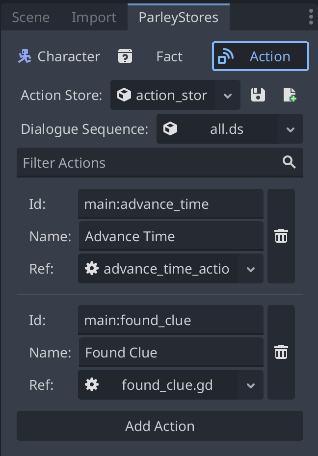

An Action Store is a store for actions. Actions are developer-defined
functionality that will execute during the processing of a Dialogue Sequence.
For example, emitting a signal, registering a journal entry, or updating state.
These are managed and stored in the Parley Action Store.

Parley provides the ability for users to manage actions via the `Action` tab in
the `ParleyStores` dock:

To find out how to register an action to the Store, follow
[this guide](../getting-started/register-action.md).
