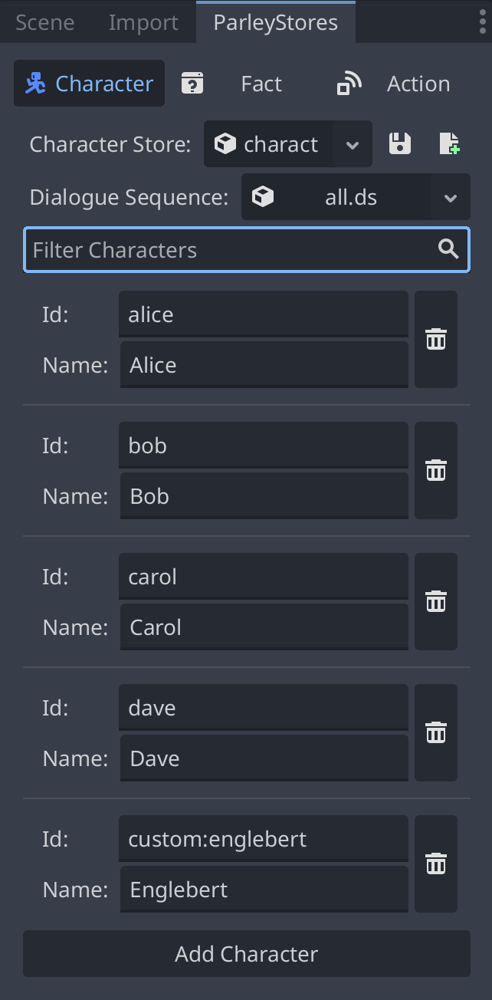

A Character Store is a store for characters. As the name suggests, Characters
are resources in Parley used to define characters within a Dialogue Sequence.

Parley provides the ability for users to manage characters via the `Character`
tab in the `ParleyStores` dock:

To find out how to register a character to the Store, follow
[this guide](../getting-started/register-character.md).
