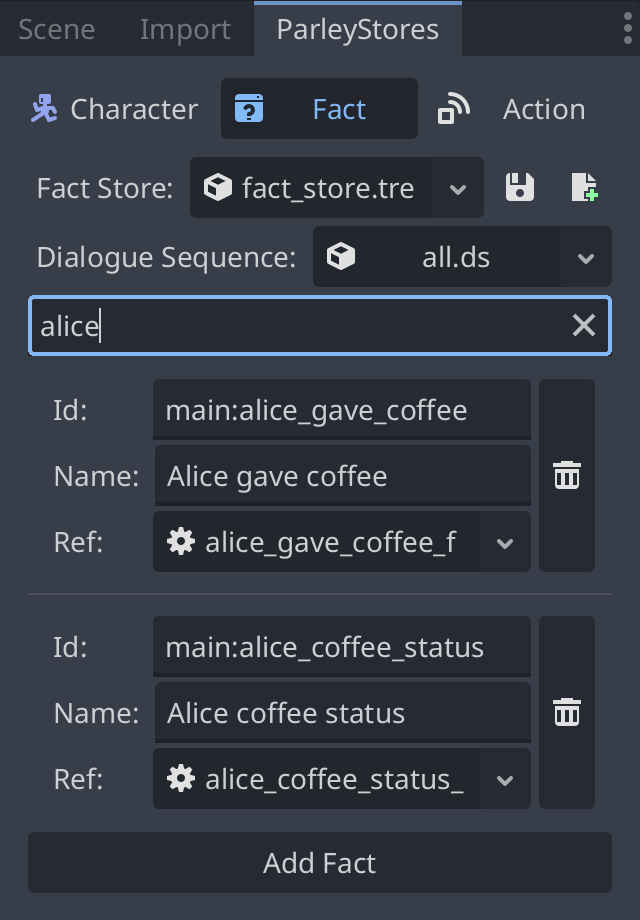

A Fact Store is a store for facts. Facts are resources in Parley used by
Condition and Match Nodes for comparisons within the currently running game. For
example, one might want to display different dialogue depending on whether a
condition check is passed or not (e.g. whether Alice gave a coffee or not).

Parley provides the ability for users to manage facts via the `Fact` tab in the
`ParleyStore` dock:

To find out how to register a fact to the store, follow
[this guide](../getting-started/register-fact.md).
